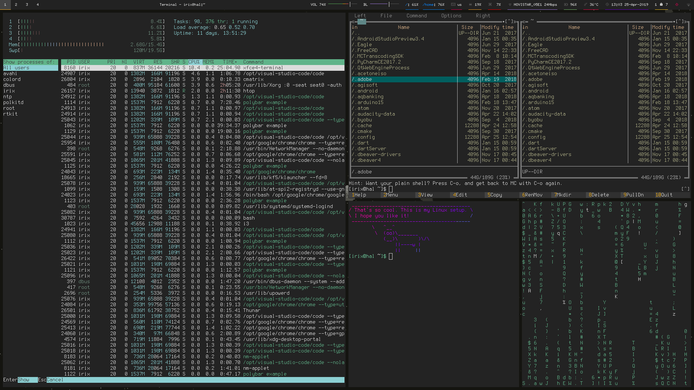

# My Computing

This is how I do my computing

## The Operating System

I started using Linux distributions in the mid 90's. In the age of Windows 95 -still rocking the floppy disks- I was experimenting with Red Hat Linux and Debian. In 2004 I moved to Mac OS X and it was cool for a while. But then in 2013, I realised I was trapped. I became an Apple Victim. I needed to buy the iPhone to be compatible with the Macbook Pro and also the play music with iTunes and iThis and iThat and iWantedtogetthef@ckoutofthere. So fed up of the lack of freedom, I went back to Linux. I am now using Arch Linux, a rolling release distribution. And I think I will stay like this for a while. Arch Linux is not for beginners though.

Currently testing [Archlabs](https://archlabslinux.com/) distribution

## The Window Manager

I used XFCE for a long time with compiz. It is very lightweight and it has many cool effects. But maybe biased from my 8-bit age, I use mostly command line tools. For that reason I swapped my window manager to [i3wm](https://i3wm.org/).

The program launcher I use is [rofi](https://github.com/DaveDavenport/rofi)

The bar I use in i3 is [polybar](https://github.com/jaagr/polybar)

For lock screen I have key combo that triggers a [script]() that pixelates the current screen.

## Cool CLI programs

### Betty, the CLI Siri

I bet you didn't know this one. Start with `Betty what time is it?`

### The Fuck

Have you ever forget to use `sudo`? After a command fails, use `fuck`, then it will fix it for you LOL!

### Check file sizes with `du` `ncdu` and `df`

### Monitor the system with `htop` `gtop` and `powertop`

### iponmap

Mandatory tool for hackers pretending be cool. It will place a dot in a map when you supply an IP address. Try `iponmap 4.4.4.4` 

### wego

An awesome ASCII CLI weather tool for the terminal
  
### instantmusic

`instantmusic` is a `youtube-dl` variant for downloading music. Just type `instantmusic` and the tool will ask you to enter any detail about the song you want (artist, song name, etc...). It will display a list of options for you to download. The resulting format will be a `mp3` file

### neomutt

The classic mail client `mutt` just supercharged with some extra functionalities.

### mapscii

That is one of these amazing cli tools! Just explore highly detailed maps from the command line.

### midnight commander

A file navigation system

### asciinema

`asciinema` is a tool to record and share terminal sessions.

### nms

Did you watch [Sneakers](https://en.wikipedia.org/wiki/Sneakers_(1992_film)) the movie? You will probably remember this [scene](https://www.youtube-nocookie.com/embed/GS3npSv8iuM).

`nms` is a command that does exactly that! I usually use it in a pipe. Try `ls | nms` and pretend you are a hacker decoding your own disk.

### cmatrix

For those like me who like to pretend they are hackers you have this tool that will show a matrix encoded screen.

### cowsay

`cowsay` is a funny way to echo messages to the screen. I usually pipe it to `lolcat`

### ponysay

An even cooler alternative to `cowsay` is `ponysay` with it's full colour drawings (do not pipe to `lolcat` or you will mess up the colours!).

### lolcat

`lolcat` is a colourful variant of `cat`. It just displays the file in a full rainbow gradient.

### irssi

A great IRC client for the cli. I really miss those IRC days and I use it all the time. For those born in the 80's and later check this [quick start guide](https://irssi.org/documentation/startup/).

### scrot

`scrot` is a cli tool for taking SCReenshOTs. It has plenty of options.

### testdisk

`testdisk` is the perfect data recovery tool for the cli. It can undelete files you mistakenly wiped out.