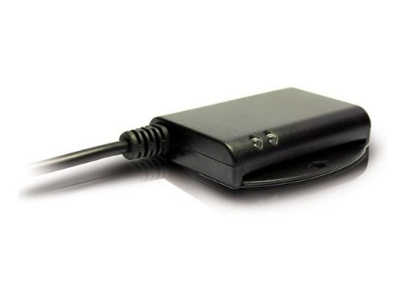
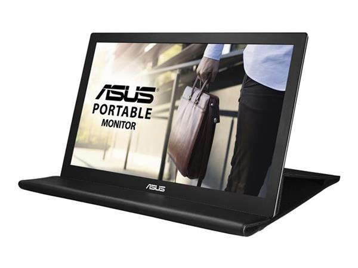
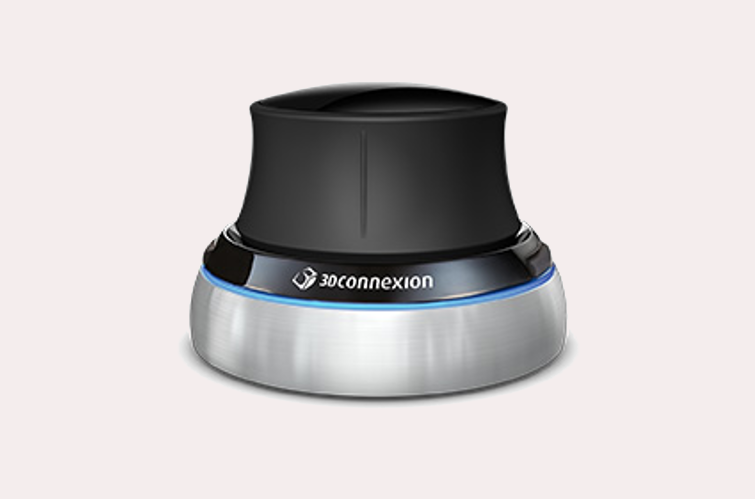
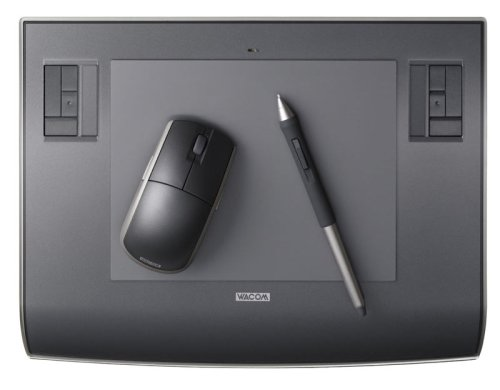
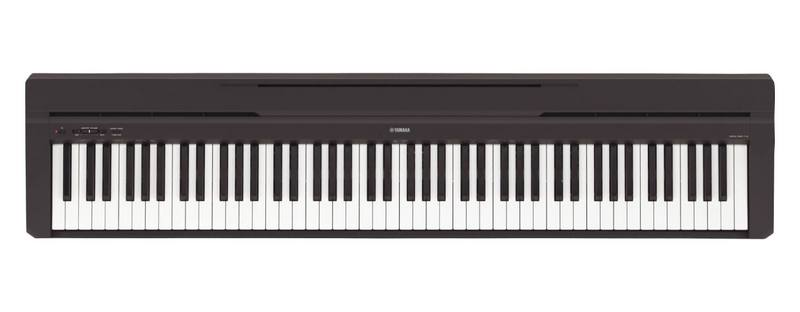

# My Computing
 
This is how I do my computing 

## The Operating System

I started using Linux distributions in the mid 90's. In the age of Windows 95 -still rocking the floppy disks- I was experimenting with Red Hat Linux and Debian. In 2004 I moved to Mac OS X and it was cool for a while. But then in 2013, I realised I was trapped. I became an Apple Victim. I needed to buy the iPhone to be compatible with the Macbook Pro and also the play music with iTunes and iThis and iThat and iWantedtogetthef@ckoutofthere. So fed up of the lack of freedom, I went back to Linux. I am now using Arch Linux, a rolling release distribution. And I think I will stay like this for a while. Arch Linux is not for beginners though.

## The display manager

I chose a console display manager called [ly](https://github.com/cylgom/ly) with a custom `/etc/ly/config.ini` and a modifyed language file. Somehow modifying `/etc/ly/lang/en.ini` did not have any effect, so I created a copy called `/etc/ly/lang/en2.ini` and called it from the config file. 

Since I did not like the original console font I [modified](https://wiki.archlinux.org/index.php/Linux_console#Fonts) `/etc/vconsole.conf` to use [Lat2-Terminus16](http://alexandre.deverteuil.net/pages/consolefonts/) with 8859-1 font map.

```bash
FONT=Lat2-Terminus16
FONT_MAP=8859-1
```

To use that font from from the early userspace I make sure I use the `consolefont` hook in `/etc/mkinitcpio.conf`. Also load the graphics driver module (in my case intel) earlier in [Early KMS start](https://wiki.archlinux.org/index.php/Kernel_mode_setting#Early_KMS_start) to avoid font changes/flickering/glitches. To apply these changes rebuild with your kernel preset `sudo mkinitcpio -p linux51` (check your kernel presets in `ls /etc/mkinitcpio.d`). Then reboot.

## The Window Manager

In the past, I used XFCE for a long time with compiz. XFCE is very lightweight and compiz has many cool effects. But maybe biased from my 8-bit age, I use mostly command line tools. For that reason I swapped my window manager to [i3wm](https://i3wm.org/). Actually an i3 fork with [gaps](https://github.com/Airblader/i3).

The program launcher I use is [rofi](https://github.com/DaveDavenport/rofi) with some [themes](https://github.com/davatorium/rofi-themes).

The bar I use in i3 is [polybar](https://github.com/jaagr/polybar)

> TODO For lock screen I have key combo that triggers a [script]() that pixelates the current screen.

## Terminal emulator

I am using uxterm with [Iosevka](https://github.com/be5invis/Iosevka) font. 

## Cursor theme

I downloaded [Bibata Ice](https://github.com/KaizIqbal/Bibata_Cursor) cursor theme and placed it `/usr/share/icons/` and then call it in `~/.Xresources` 

`Xcursor.theme: Bibata Ice`

But somehow is not loading in i3wm. When I execute `fix_xcursor` it does not get the full name:

```bash
[irix@hal ~]$ fix_xcursor
setting cursortheme "Bibata"
```

Does not matter if I use single or double quotes. The name of the cursor theme is set by `/usr/share/icons/Bibata_Ice/index.theme` file:

```bash
[Icon Theme]
Name=Bibata Ice
Comment=Light Bibata Cursor Theme
Name[ar]=Bibata Ice
Name[bg]=Bibata Ice
...
```
## Cool GUI programs

### Xournal

A simple tool to fill out and annotate PDFs

### Losless Cut

[Lossless Cut](https://github.com/mifi/lossless-cut) has saved me GigaBytes of storage by allowing me to trim videos losslessly. This is a must for video.


## Cool CLI programs

### scrot

`scrot` is a cli tool for taking SCReenshOTs. It has plenty of options.

### Betty, the CLI Siri

I bet you didn't know this one. Start with `Betty what time is it?`

### Check file sizes with `du` `ncdu` and `df`

### Monitor the system with `htop` `gtop` and `powertop`

### iponmap

Mandatory tool for hackers pretending be cool. It will place a dot in a map when you supply an IP address. Try `iponmap 4.4.4.4` 

### wego

An awesome ASCII CLI weather tool for the terminal. You need to register for an API key [here](https://developer.forecast.io/register).
  
### instantmusic

`instantmusic` is a `youtube-dl` variant for downloading music. Just type `instantmusic` and the tool will ask you to enter any detail about the song you want (artist, song name, etc...). It will display a list of options for you to download. The resulting format will be a `mp3` file

### neomutt

The classic mail client `mutt` just supercharged with some extra functionalities.

### mapscii

That is one of these amazing cli tools! Just explore highly detailed maps from the command line.

### midnight commander

A file navigation system for the CLI to easily copy/move/detete files and folders. It's main characteristic is the split screen. Some useful shortcuts to get used to it:

- `CONTROL` + `o` toggle MC and terminal
- `ALT` + `.` toggle hidden files
- `CONTROL` + `u` swap the panels
- `ALT` + `i` bring inactive panel to the same directory as the active panel
- `TAB` jump between panels
- `ALT` + `s` find as you type and select. Next by using `ALT` + `s` again
- `INSERT` or right click toggle select file/folder under the cursor
- `*` invert the selection
- `+` or `-` select or deselect using a pattern
- When copying or moving, the opposite panel is selected as the destination
- `F3` quick view a text file
- `F4` quick edit a text file

### vifm

Another cli file manager

### asciinema

`asciinema` is a tool to record and share terminal sessions.

### nms

Did you watch [Sneakers](https://en.wikipedia.org/wiki/Sneakers_(1992_film)) the movie? You will probably remember this [scene](https://www.youtube-nocookie.com/embed/GS3npSv8iuM).

`nms` is a command that does exactly that! I usually use it in a pipe. Try `ls | nms` and pretend you are a hacker decoding your own disk.

### cmatrix

For those like me who like to pretend they are hackers you have this tool that will show a matrix encoded screen.

### lolcat

`lolcat` is a colourful variant of `cat`. It just displays the file in a full rainbow gradient.

### cowsay

`cowsay` is a funny way to echo messages to the screen. I usually pipe it to `lolcat`


### ponysay

An even cooler alternative to `cowsay` is `ponysay` with it's full colour drawings (do not pipe to `lolcat` or you will mess up the colours!).

### irssi

A great IRC client for the cli. I really miss those IRC days and I use it all the time. For those born in the 80's and later check this [quick start guide](https://irssi.org/documentation/startup/).

### testdisk

`testdisk` is the perfect data recovery tool for the cli. It can undelete files you mistakenly wiped out.

### cal

This simple tool allows you to display a simple calendar with many display options available.


### bat

`bat` is a syntax higlighted `cat`. I use all the time to display files

### grabc

`grabc` is a small color picker utility from the command line. Jus type `grabc` and a small cross cursor will appear. Click on the color you want to capture and it will appear in the terminal as hex value.

## Arch Linux common daily tasks

### Time and timezones

In my laptop the hardware clock (BIOS clock) is considered by the operating system (arch) as UTC. So it is important to set that appropiately first.

`sudo hwclock --show`

I travel quite often and I need to adjust the timezone in my computer. I do it with `timedatectl`

`timedatectl status` check the current time, date and timezone. The following will appear:

```bash
[unix ~]$ timedatectl status
               Local time: Fri 2019-11-08 18:42:28 CET
           Universal time: Fri 2019-11-08 17:42:28 UTC
                 RTC time: Fri 2019-11-08 17:42:28
                Time zone: Europe/Madrid (CET, +0100)
System clock synchronized: no
              NTP service: inactive
          RTC in local TZ: no
```

`timedatectl list-timezones` check the timezones
`timedatectl set-timezone zone/subzone` Set the timezone

### Find all files containing specific text

`grep -rnw '/path/to/somewhere/' -e 'pattern'`

- `-r` or `-R` is recursive,
- `-n` is line number
- `-w` stands for match the whole word.
- `-l` (lower-case L) can be added to just give the file name of matching files.

Along with these, `--exclude`, `--include`, `--exclude-dir` flags could be used for efficient searching:

This will only search through those files which have .c or .h extensions:

`grep --include=\*.{c,h} -rnw '/path/to/somewhere/' -e "pattern"`

This will exclude searching all the files ending with .o extension:

`grep --exclude=*.o -rnw '/path/to/somewhere/' -e "pattern"`

For directories it's possible to exclude a particular directory(ies) through --exclude-dir parameter. For example, this will exclude the dirs dir1/, dir2/ and all of them matching *.dst/:

`grep --exclude-dir={dir1,dir2,*.dst} -rnw '/path/to/somewhere/' -e "pattern"`

### Mount a USB drive

Check the device name with `lsblk` and then use `pmount device [ label ]` and `pumount` to mount/unmount it. If label is given, the mount point will be `/media/label`,
otherwise it will be `/media/device`.

### Install a font

Move it to `~/.local/share/fonts`. More info [here](https://wiki.archlinux.org/index.php/Fonts)

### VNC server

I use [TigerVNC](https://tigervnc.org/) for it's easy use.

#### Starting a VNC server

Place a password/passphrase in `~/.vnc/passwd`

To start `x0vncserver -display :0 -passwordfile .vnc/passwd`

To stop just close the terminal process.

## Screen

### Show the connected displays

`xrandr`

### Set physical dimensions of your display

Useful for showing real dimensions at 100% `xrandr --fbmm 310x175`

### Fix overscan problems in HDMI

This should work `xrandr --output HDMI1 --set underscan on --set "underscan vborder" 25 --set "underscan hborder" 40` but it is not working in my case

## Network

### Changing the network interface names

Add/edit a file in `/etc/udev/rules.d/10-network.rules` and reboot

```
SUBSYSTEM=="net", ACTION=="add", ATTR{address}=="c8:5b:76:e5:fc:23", NAME="cable0"
SUBSYSTEM=="net", ACTION=="add", ATTR{address}=="00:28:f8:2b:12:18", NAME="wifi0"
```

### Activating or deactivating network devices

Activate ethernet: `sudo ip link set cable0 up`

Deactivate wifi: `sudo ip link set wifi0 down`

### Obtaining DHCP address

`dhcpcd cable0`

### Get your public IP

`curl https://ipinfo.io/ip` you can pipe it to `iponmap`

`curl https://ipinfo.io/ip | iponmap`

### Check current UL/DL speed

`vnstat --live -i wifi0`

### Extend free wifi at airports

They usually bind the 1h free connection to the MAC address of the device. So after the 1h is out just change the MAC address and connect again.

#### Change MAC address with `macchanger`

First install `macchanger` and then use it like this:

`macchanger -r wifi0` obtain a random MAC address

`macchanger -p wifi0` return to the hardware factory MAC address

#### Change MAC address with vanilla commands

This process is a bit longer, just if your haven't yet downloaded `macchanger`, use this instead:

```bash
ip link show wifi0
ip link set dev wifi0 down
ip link set dev wifi0 address xx:xx:xx:yy:yy:yy
ip link set dev wifi0 up
```

#### Change MAC address to a rooted Android in terminal

Open `termux` or any other terminal app and look for your wifi interface (here `wlan0`):

```bash
su
ip link show
busybox ip link show wlan0
busybox ifconfig wlan0 hw ether xx:xx:xx:yy:yy:yy
```

> **Warning!** These changes are permanent

## Video and YouTube

### Download youtube video and subtitles

`youtube-dl --write-auto-sub` URL-VIDEO

### Hardcode subtitles into video

`ffmpeg -i` VIDEO-FILE `-vf subtitles=`SUBS-FILE OUTPUT-FILE

### Download audio from youtube video

First check the available formats

`youtube-dl -F GKgfCthuiV0` where GKgfCthuiV0 is the youtube code of the video

```
[youtube] GKgfCthuiV0: Downloading webpage
[youtube] GKgfCthuiV0: Downloading video info webpage
[info] Available formats for GKgfCthuiV0:
format code  extension  resolution note
249          webm       audio only tiny   69k , opus @ 50k (48000Hz), 3.38MiB
250          webm       audio only tiny   87k , opus @ 70k (48000Hz), 4.29MiB
140          m4a        audio only tiny  130k , m4a_dash container, mp4a.40.2@128k (44100Hz), 6.95MiB
251          webm       audio only tiny  157k , opus @160k (48000Hz), 7.91MiB
160          mp4        192x144    144p   13k , avc1.4d400b, 25fps, video only, 436.59KiB
133          mp4        320x240    240p   18k , avc1.4d400d, 25fps, video only, 528.49KiB
278          webm       192x144    144p   27k , webm container, vp9, 25fps, video only, 755.36KiB
394          mp4        192x144    144p   30k , av01.0.00M.08, 25fps, video only, 892.15KiB
395          mp4        320x240    240p   47k , av01.0.00M.08, 25fps, video only, 1.17MiB
242          webm       320x240    240p   48k , vp9, 25fps, video only, 1.13MiB
18           mp4        400x300    240p  147k , avc1.42001E, mp4a.40.2@ 96k (44100Hz), 7.90MiB (best)
```

Select the one you want, in my case 251, which is the highest quality

`youtube-dl -f 251 GKgfCthuiV0`

Now transcode the webm file into wav (or any other) format you want

`ffmpeg -i file.webm file.wav`

### Convert GIF to MP4

`ffmpeg -i animated.gif -movflags faststart -pix_fmt yuv420p -vf "scale=trunc(iw/2)*2:trunc(ih/2)*2" video.mp4`

Explanation

- `movflags` – This option optimizes the structure of the MP4 file so the browser can load it as quickly as possible.
- `pix_fmt` – MP4 videos store pixels in different formats. We include this option to specify a specific format which has maximum compatibility across all browsers.
- `vf` – MP4 videos using H.264 need to have a dimensions that are divisible by 2. This option ensures that’s the case.

### DSLR Video Webcam

#### Hardware required

You need a capture card to get the HDMI out signal from the DSLR. I bought a cheap HDMI to USB3 capture card in Amazon that works with the V4L2 module without drivers, just plug and play. The card is unbranded and the chipset inside is:

```bash
[66367.259465] usb 2-2: Product: FHD Capture
[66367.259468] usb 2-2: Manufacturer: VXIS Inc
[66367.269584] uvcvideo: Found UVC 1.00 device FHD Capture (1bcf:2c99)
```

The DSLR camera will become now a Webcam. You can even select it in your videoconferences.

It is convenient that you also get a AC battery adapter to make sure the battery won't die during capture.

#### Software required

You can capture video with pretty much anything but I mostly use [OBS Studio](https://obsproject.com/). It allows you to create scenes, overlays, green screen, etc.

#### Canon 7D

The Canon 7D has a mini HDMI port out. With the Canon firmware 2.0.3 I cannot obtain a clean HDMI out. There is always the focus rectangle there. So I downloaded [Magoc Lantern Firmware](https://magiclantern.fm/). To control the camera settings I use [Entangle](https://entangle-photo.org/) which allows me to capture images as well as control the camera settings.

#### Canon M6

Canon M6 has a micro HDMI port. With the Canon M6 I can obtain a clean HDMI out in manual focus. But controlling the camera settings is just annoying. USB tether does not seem to work and there is a Canon App which is so faulty. 

Magic Lantern is not available for the M6. It could run [CHDK](https://chdk.fandom.com/wiki/CHDK) but at the moment of writing the firmware is still unported.

## Dummy serial and lp ports

In order to create a dummy serial port for developing purposes install `tty0tty-git` AUR package and load the module:

```bash
sudo depmod
sudo modprobe tty0tty
```

You will see a number of serial ports `/dev/tntx`, make sure you give them permissions `sudo chmod 666 /dev/tnt*`

For testing printers and other devices, just send to `/dev/null`

## Polybar

For displaying siji fonts `xfd -fa siji` check the glyph code and display with the code. For example `printf "\ue101"`

## Audio

### Jack Audio

The default audio server in Linux is `pulseaudio`. That is fine for standard use (one recording sink). But once you start having more complex situations, where you want to record the output of the speakers or you want multiple recordings or playbacks, you will find limitations. That cannot be achieved with `pulseaudio`. You need a more advanced audio server. That server is `jack`.

Installing jack is a bit tricky: install the following packages `jack2 libffado cadence jack_capture python-dbus realtime-privileges pulseaudio-jack`, add yourself to the groups `audio` and `realtime` then reboot. You should be able to start jack via `cadence`. Then make sure you autostart at boot. Otherwise you might notice that you cannot start `jack` if there is any other program using the audio, including browsers since they might block the interface. Hence the need to start `jack` server before starting any other audio software.

 Also bridge **ALSA Audio** using `ALSA > PulseAudio > JACK (Plugin)` option and bridge **PulseAudio** with Auto-start at login. Otherwise you might realise that you cannot play youtube videos while `jack` is running. 
 
 In that case install the pakage `pulseaudio-jack`. Then edit `/etc/pulse/default.pa` and the following below `#load-module module-alsa-sink` section:

```bash
load-module module-jack-sink
load-module module-jack-source
```

And restart pulseaudio with `killall pulseaudio`

### alsamixer

To set the default sound card. Check your devices `cat /proc/asound/cards`

```
 0 [PCH            ]: HDA-Intel - HDA Intel PCH
                      HDA Intel PCH at 0xe2340000 irq 137
 1 [Microphone     ]: USB-Audio - Yeti Stereo Microphone
                      Blue Microphones Yeti Stereo Microphone at usb-0000:00:14.0-2.3, full speed
 2 [Capture        ]: USB-Audio - FHD Capture
                      VXIS Inc FHD Capture at usb-0000:00:14.0-2.2, super speed
```

 `aplay -l`
 
 ```
 **** List of PLAYBACK Hardware Devices ****
card 0: PCH [HDA Intel PCH], device 0: CX8200 Analog [CX8200 Analog]
  Subdevices: 0/1
  Subdevice #0: subdevice #0
card 0: PCH [HDA Intel PCH], device 3: HDMI 0 [HDMI 0]
  Subdevices: 1/1
  Subdevice #0: subdevice #0
card 0: PCH [HDA Intel PCH], device 7: HDMI 1 [HDMI 1]
  Subdevices: 1/1
  Subdevice #0: subdevice #0
card 0: PCH [HDA Intel PCH], device 8: HDMI 2 [HDMI 2]
  Subdevices: 1/1
  Subdevice #0: subdevice #0
card 0: PCH [HDA Intel PCH], device 9: HDMI 3 [HDMI 3]
  Subdevices: 1/1
  Subdevice #0: subdevice #0
card 0: PCH [HDA Intel PCH], device 10: HDMI 4 [HDMI 4]
  Subdevices: 1/1
  Subdevice #0: subdevice #0
card 1: Microphone [Yeti Stereo Microphone], device 0: USB Audio [USB Audio]
  Subdevices: 1/1
  Subdevice #0: subdevice #0
```
 
 and modify `sudo nano /etc/asound.conf`

```
# Use CX8200 by default
pcm.!default {
  type hw
  card 0
    hint {
    show on
    description "Default ALSA Output (currently CX8200 sound card)"
  }
}

ctl.!default {
  type hw
  card 0
}
```

To set the default mutes/levels in alsamixer `su` and `alsactl store`

### Ardour

Ardour requires you to start jack server previously.

### Helm

### Carla

### MindMapp

### Anbox

### Piskel

### gallery-dl

### Ghostwriter

### sway

## Hardware

### PS3 Eye

> Placeholder for Playstation 3 Eye

### DNIe reader

I have an LTC31



And an ACR38 from Estonia digital citizenship 


Insert your DNIe reader and check with `lsusb`, you should see one of your readers, among other USB devices

```
[unix ~]$ lsusb
Bus 001 Device 013: ID 0783:0006 C3PO LTC31v2
Bus 001 Device 015: ID 072f:90cc Advanced Card Systems, Ltd ACR38 SmartCard Reader
...
```

Install the following packages `opensc ccid` other sources say ` pcsc-perl pcsc-tools pcsclite ` and AUR `libpkcs11-dnie ca-certificates-dnie`. Then try to read the scanner with `pcsc_scan`

```
[unix ~]$ pcsc_scan
Using reader plug'n play mechanism
Scanning present readers...
0: C3PO LTC31 v2 (00426712) 00 00
 
Wed Dec  4 11:14:10 2019
 Reader 0: C3PO LTC31 v2 (00426712) 00 00
  Event number: 1
  Card state: Card removed, 
 / 
```

> If you see something like `SCardEstablishContext: Service not available` try restarting the service with `systemctl restart pcscd.socket` and try again.

With a DNIe inserted you should see this:

```
[unix ~]$ pcsc_scan
Using reader plug'n play mechanism
Scanning present readers...
0: C3PO LTC31 v2 (00426712) 00 00
 
Wed Dec  4 11:16:59 2019
 Reader 0: C3PO LTC31 v2 (00426712) 00 00
  Event number: 2
  Card state: Card inserted, 
  ATR: 3B 7F 96 00 00 00 6A 44 4E 49 65 10 01 01 55 04 21 03 90 00

ATR: 3B 7F 96 00 00 00 6A 44 4E 49 65 10 01 01 55 04 21 03 90 00
+ TS = 3B --> Direct Convention
+ T0 = 7F, Y(1): 0111, K: 15 (historical bytes)
  TA(1) = 96 --> Fi=512, Di=32, 16 cycles/ETU
    250000 bits/s at 4 MHz, fMax for Fi = 5 MHz => 312500 bits/s
  TB(1) = 00 --> VPP is not electrically connected
  TC(1) = 00 --> Extra guard time: 0
+ Historical bytes: 00 6A 44 4E 49 65 10 01 01 55 04 21 03 90 00
  Category indicator byte: 00 (compact TLV data object)
    Tag: 6, len: A (pre-issuing data)
      Data: 44 4E 49 65 10 01 01 55 04 21
    Mandatory status indicator (3 last bytes)
      LCS (life card cycle): 03 (Initialisation state)
      SW: 9000 (Normal processing.)

Possibly identified card (using /usr/share/pcsc/smartcard_list.txt):
3B 7F 96 00 00 00 6A 44 4E 49 65 10 01 01 55 04 21 03 90 00
3B 7F 96 00 00 00 6A 44 4E 49 65 10 01 01 55 04 .. 03 90 00
        DNIE Spain (eID)
        http://www.dnielectronico.es/PortalDNIe/
 | 
```

Now in Firefox go to preferences, search for `devices` and click on `security devices`. Click `load` and add a meaningful name like `DNIe` and locate the following file `/usr/lib/libpkcs11-dnietif.so`. Now you should see the reader, if you select the reader and click on `log in` you can enter your DNIe pin/password and you are all set.

> Missing adding ACR38 device in Firefox

To electronically sign documents like PDF install the AUR package `autofirma`.

### Asus MB168B+ USB display



This is a displaylink USB screen I use for video editing and also following tutorials while I run a program. Make sure you have `linux-headers` package already installed. You must install the [displaylink](https://aur.archlinux.org/packages/displaylink/) AUR package that allows configuring displaylink monitors using [Xrandr](https://wiki.archlinux.org/index.php/Xrandr). Then create the file `/usr/share/X11/xorg.conf.d/20-evdidevice.conf` with the following content:

```bash
Section "OutputClass"
	Identifier "DisplayLink"
	MatchDriver "evdi"
	Driver "modesetting"
	Option  "AccelMethod" "none"
EndSection
```

and reboot. My config for extra screen:

`xrandr --output eDP-1 --primary --auto --output DVI-I-1-1 --right-of eDP-1 --auto`

If I want it rotated then

`xrandr --output eDP-1 --primary --auto --output DVI-I-1-1 --rotate left --right-of eDP-1 --auto`

or mirror:

`xrandr --output eDP-1 --primary --auto --output DVI-I-1-1 --same-as eDP-1 --auto`

### HDMI

 My config for extra screen:

`xrandr --output eDP-1 --primary --auto --output HDMI-1 --right-of eDP-1 --auto`

or mirror:

`xrandr --output eDP-1 --primary --auto --output HDMI-1 --same-as eDP-1 --auto`

### Space Navigator



For a [free, open source alternative driver](http://spacenav.sourceforge.net/) to the proprietary [3DConnexion](https://www.3dconnexion.com), install the packages `spacenavd` and the config tool `spnavcfg`. Start the mouse with:

`sudo systemctl start spacenavd`

Enable the service if you want to run it everytime you boot.

`sudo systemctl enable spacenavd`

At the time of writing (September 2019) Space Navigator is having trouble with the Appimage version of FreeCAD. It works just fine in the AUR compiled version. It just takes a long time to compile.

### Contour Shuttle Pro 2


This is a device I use to edit video. I Installed `contour-shuttle-git` AUR package and now I am missing the key configuration file for Lightworks

https://www.lwks.com/index.php?option=com_kunena&func=view&catid=217&id=83353&Itemid=

https://www.lwks.com/index.php?option=com_kunena&func=view&catid=217&id=116188&Itemid=81

http://freshmeat.sourceforge.net/projects/shuttlepro 

### Wacom Intuos 3



My old tablet for drawing and painting, still works like a charm. I am learning to use it now with grease pencil, the new feature in blender 2.8. You need to install the  `xf86-input-wacom` and reboot. You should now see some devices with the command `xsetwacom list devices`.

```bash
[unix ~]$ xsetwacom list devices
Wacom Intuos3 6x8 Pen stylus            id: 10  type: STYLUS    
Wacom Intuos3 6x8 Pad pad               id: 11  type: PAD       
Wacom Intuos3 6x8 Pen eraser            id: 17  type: ERASER    
Wacom Intuos3 6x8 Pen cursor            id: 18  type: CURSOR
```

If you use dual head monitors `xrandr` sets both monitors as one big screen, mapping the tablet to the whole virtual screen and deforming aspect ratio. For a solution, map the Stylus and the eraser (id 10 and 17) to the desired screen, in my case, eDP-1.

```bash
xsetwacom set 10 MapToOutput eDP-1
xsetwacom set 17 MapToOutput eDP-1
```

Graphical config tool `kcm-wacomtablet`.

### Yamaha P-45



This electronic piano can be used as a MIDI input in LMMS and other software. I like it because it has pressure sensitive keys and it's full size. It does not need any driver. Just connect it via usb and check that it is properly detected:

```bash
[unix ~]$ lsusb
Bus 001 Device 009: ID 0499:160f Yamaha Corp. P-105
```

Then with `alsa-utils` installed check the device number for input and output:

```bash
[unix ~]$ aconnect -i
client 0: 'System' [type=kernel]
    0 'Timer           '
    1 'Announce        '
client 14: 'Midi Through' [type=kernel]
    0 'Midi Through Port-0'
client 20: 'Digital Piano' [type=kernel,card=1]
    0 'Digital Piano MIDI 1'

[unix ~]$ aconnect -o
client 14: 'Midi Through' [type=kernel]
    0 'Midi Through Port-0'
client 20: 'Digital Piano' [type=kernel,card=1]
    0 'Digital Piano MIDI 1'
```
And you can connect this device to your DAW or MIDI software. Check the activity with `aseqdump`. So far is not detecting pressure sensitivity. I haven't checked the foot pedal yet.

```bash
[unix ~]$ aseqdump -p 20
Waiting for data. Press Ctrl+C to end.
Source  Event                  Ch  Data
 20:0   Clock
 20:0   Active Sensing
 20:0   Clock
 20:0   Clock
 20:0   Note off                0, note 91
 20:0   Clock
 20:0   Clock
 20:0   Note on                 0, note 93, velocity 64
 20:0   Clock
 20:0   Clock
 20:0   Clock
 20:0   Note off                0, note 93
 20:0   Clock
 20:0   Note on                 0, note 91, velocity 64
 20:0   Clock
 20:0   Clock
 20:0   Active Sensing
 20:0   Clock
 20:0   Clock
 20:0   Note off                0, note 91
 20:0   Clock
 20:0   Note on                 0, note 93, velocity 64
 20:0   Clock
 20:0   Clock
 20:0   Clock
 20:0   Clock
 20:0   Note off                0, note 93
 20:0   Note on                 0, note 91, velocity 64
 20:0   Clock
 20:0   Clock
 20:0   Clock
 20:0   Active Sensing
 20:0   Note off                0, note 91
```


### Canon LiDE 60


At the time of writing `sane 1.0.28` has a bug that prevents using the Canon LiDE 60:

`Failed to open device 'genesis:libusb:001:005': Invalid argument.`

Downgrade/install an old version of sane:

`sudo pacman -U https://archive.archlinux.org/packages/s/sane/sane-1.0.27-2-x86_64.pkg.tar.xz`

And ignore the sane package to prevent an upgrade in `/etc/pacman.conf` until a fix is found.

Install also the frontend `xsane`. Add yourself to the scanner group and reboot `sudo usermod -a -G scanner $USER`

Check that your scanner is listed `scanimage -L`. If you don't want your cameras to be listed comment `v4l` in `/etc/sane.d/dll.conf`.

Try to scan something through xsane or manually using the device name shown in the step above:

`scanimage --device "genesys:libusb:001:004" --format=png > test.png`

### eGPU Beast 8.5c

This is an external GPU adapter that I bought on [Amazon](https://amzn.to/2nruDnH). My version has a expresscard that I use for my Thinkpad X220. Seems to work with the Radeon HD6450. The following command detects the card:

`lspci -k | grep -A 2 -i "VGA"`

But does not detect my Nvidia 8800GT so far. Still researching.

#### For Radeon HD 6450

Install the open source driver `xf86-video-ati`. Install also `radeon-profile-git` AUR package which installs a qt application `radeon-profile` to display info about a Radeon card. 

If I insert the expresscard after booting, `radeon-profile` shows no card. I suspect the Kernel module is not loaded. 

If I reboot with the expresscard inserted then the radeon kernel module loads and the screen goes to the radeon HDMI, leaving the laptop screen black. `startx` fails: XF86enableIOPorts operation not permitted. KMS Kernel modesetting enabled

### Trackpad tips

I use `libinput` driver instead of the former `xf86-input-synaptic`. Something that I hate of the standars behaviour of the trackpad is the area for middle and right click, because I usually accidentally click the wrong button.

By deffault touchpad is disabled while typing. But for playing with the synths knobs you will want it activated. In order to have the touchpad (or any other input device) working while a key is pressed do the following:

```
[unix ~]$ xinput list
⎡ Virtual core pointer                          id=2    [master pointer  (3)]
⎜   ↳ Virtual core XTEST pointer                id=4    [slave  pointer  (2)]
⎜   ↳ Synaptics TM3289-002                      id=14   [slave  pointer  (2)]
⎜   ↳ TPPS/2 ALPS TrackPoint                    id=15   [slave  pointer  (2)]
⎣ Virtual core keyboard                         id=3    [master keyboard (2)]
    ↳ Virtual core XTEST keyboard               id=5    [slave  keyboard (3)]
    ↳ Power Button                              id=6    [slave  keyboard (3)]
    ↳ Video Bus                                 id=7    [slave  keyboard (3)]
    ↳ Sleep Button                              id=8    [slave  keyboard (3)]
    ↳ Integrated Camera: Integrated C           id=11   [slave  keyboard (3)]
    ↳ AT Translated Set 2 keyboard              id=12   [slave  keyboard (3)]
    ↳ ThinkPad Extra Buttons                    id=13   [slave  keyboard (3)]
```

In my case it is the touchpad id is 14

```
[unix ~]$ xinput list-props 14
Device 'Synaptics TM3289-002':
        Device Enabled (169):   1
        Coordinate Transformation Matrix (171): 1.000000, 0.000000, 0.000000, 0.000000, 1.000000, 0.000000, 0.000000, 0.000000, 1.000000
        libinput Tapping Enabled (322): 0
        libinput Tapping Enabled Default (323): 0
        libinput Tapping Drag Enabled (324):    1
        libinput Tapping Drag Enabled Default (325):    1
        libinput Tapping Drag Lock Enabled (326):       0
        libinput Tapping Drag Lock Enabled Default (327):       0
        libinput Tapping Button Mapping Enabled (328):  1, 0
        libinput Tapping Button Mapping Default (329):  1, 0
        libinput Natural Scrolling Enabled (304):       0
        libinput Natural Scrolling Enabled Default (305):       0
        libinput Disable While Typing Enabled (330):    1
        libinput Disable While Typing Enabled Default (331):    1
        libinput Scroll Methods Available (306):        1, 1, 0
        libinput Scroll Method Enabled (307):   1, 0, 0
        libinput Scroll Method Enabled Default (308):   1, 0, 0
        libinput Click Methods Available (332): 1, 1
        libinput Click Method Enabled (333):    0, 1
        libinput Click Method Enabled Default (334):    1, 0
        libinput Middle Emulation Enabled (311):        0
        libinput Middle Emulation Enabled Default (312):        0
        libinput Accel Speed (313):     0.000000
        libinput Accel Speed Default (314):     0.000000
        libinput Left Handed Enabled (318):     0
        libinput Left Handed Enabled Default (319):     0
        libinput Send Events Modes Available (289):     1, 1
        libinput Send Events Mode Enabled (290):        0, 0
        libinput Send Events Mode Enabled Default (291):        0, 0
        Device Node (292):      "/dev/input/event14"
        Device Product ID (293):        1739, 0
        libinput Drag Lock Buttons (320):       <no items>
        libinput Horizontal Scroll Enabled (321):       1
```

And I see the property that controls that is 330

` xinput set-prop 14 330 0` voila!
