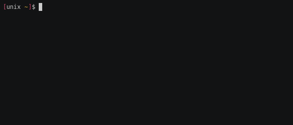
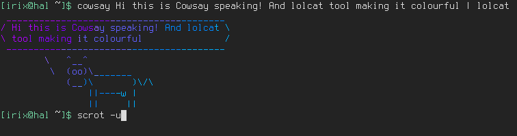

# Awesome CLI programs for Arch Linux

<!-- vim-markdown-toc GFM -->

* [corona-cli](#corona-cli)
* [scrot](#scrot)
* [Betty, the CLI Siri](#betty-the-cli-siri)
* [Check file sizes with `du` `ncdu` and `df`](#check-file-sizes-with-du-ncdu-and-df)
* [Monitor the system with `htop` `gtop` and `powertop`](#monitor-the-system-with-htop-gtop-and-powertop)
* [iponmap](#iponmap)
* [instantmusic](#instantmusic)
* [neomutt](#neomutt)
* [mapscii](#mapscii)
* [asciinema and asciicast2gif](#asciinema-and-asciicast2gif)
* [nms](#nms)
* [cmatrix](#cmatrix)
* [lolcat](#lolcat)
* [cowsay](#cowsay)
* [ponysay](#ponysay)
* [irssi](#irssi)
* [testdisk](#testdisk)
* [cal](#cal)
* [bat](#bat)
* [grabc](#grabc)
* [lsix](#lsix)
* [fim image viewer](#fim-image-viewer)
* [qrencode](#qrencode)
* [gallery-dl](#gallery-dl)

<!-- vim-markdown-toc -->

## corona-cli

Track the coronavirus from the command line. <https://github.com/ahmadawais/corona-cli>.

## scrot

`scrot` is a cli tool for taking SCReenshOTs. It has plenty of options.

## Betty, the CLI Siri

I bet you didn't know this one. Start with `Betty what time is it?`

## Check file sizes with `du` `ncdu` and `df`

## Monitor the system with `htop` `gtop` and `powertop`

## iponmap

Mandatory tool for hackers pretending be cool. It will place a dot in a map when you supply an IP address. Try `iponmap 4.4.4.4`

## instantmusic

`instantmusic` is a `youtube-dl` variant for downloading music. Just type `instantmusic` and the tool will ask you to enter any detail about the song you want (artist, song name, etc...). It will display a list of options for you to download. The resulting format will be a `mp3` file

## neomutt

The classic mail client `mutt` just supercharged with some extra functionalities.

## mapscii

[Mapscii](https://github.com/rastapasta/mapscii) is one of these amazing cli tools! Just explore highly detailed maps from the command line.

## asciinema and asciicast2gif

[asciinema](https://asciinema.org/) is a tool to record and share terminal sessions. You can install the `asciinema` package in arch, record with `arciinema rec`, stop recording with `Ctrl+D`. You can upload it to asciinema.org or save the `.cast` file locally.

I haven't found an easy way to embed and view the cast file in the markdown files so I use another tool called [asciicast2gif](https://github.com/asciinema/asciicast2gif) that you can install with the AUR package and use it `asciicast2gif -S 1 -s 2 -w 80 -h 5 file.cast file.gif`. Not ideal since the gif files are usually large. See an example below.

## nms

Did you watch [Sneakers](https://en.wikipedia.org/wiki/Sneakers_(1992_film)) the movie? You will probably remember this [scene](https://www.youtube-nocookie.com/embed/GS3npSv8iuM).
`nms` is a command that does exactly that! I usually use it in a pipe. Try `ls | nms` and pretend you are a hacker decoding your own disk.

## cmatrix

For those like me who like to pretend they are hackers you have this tool that will show a matrix encoded screen. Consider it like a terminal screensaver.

## lolcat

`lolcat` is a colourful variant of `cat`. It just displays the file in a full rainbow gradient.

## cowsay

`cowsay` is a funny way to echo messages to the screen. I usually pipe it to `lolcat`

## ponysay

An even cooler alternative to `cowsay` is `ponysay` with it's full colour drawings (do not pipe to `lolcat` or you will mess up the colours!).

## irssi

A great IRC client for the cli. I really miss those IRC days and I use it all the time. For those born in the 80's and later check this [quick start guide](https://irssi.org/documentation/startup/).

## testdisk

`testdisk` is the perfect data recovery tool for the cli. It can undelete files you mistakenly wiped out.

## cal

This simple tool allows you to display a simple calendar with many display options available.

## bat

`bat` is a syntax higlighted `cat`. I use all the time to display files

## grabc

`grabc` is a small color picker utility from the command line. Jus type `grabc` and a small cross cursor will appear. Click on the color you want to capture and it will appear in the terminal as hex value.

## lsix

`lsix` is a simple CLI utility designed to display thumbnail images in Terminal using Sixel graphics. You need to install `imagemagick`. Before start using lsix, make sure your Terminal supports Sixel graphics. If you use UXTerm like me, then add `UXTerm*decTerminalID: vt340` in your `.Xresources` file and apply the changes with `xrdb -merge .Xresources`.

Usage, just type `lsix` or `lsix imagefile`

## fim image viewer

This is a image viewer for the command line with plenty of options. I don't like that it opens in a new window. Trying to sort it out.

## qrencode

A great utility to generate a QR, I use it to share wifi connection settings with smartphones.

`qrencode -o /tmp/wifi.png 'WIFI:S:SSID;T:wpa;P:PASSWORD;;'`

TODO:

- Autoload the image
- Integrate it with the profiles I have in /etc/netctl
- Code a reader and generate a netctl profile

## gallery-dl

A command-line program to download image-galleries and -collections from several image hosting sites <https://github.com/mikf/gallery-dl/blob/master/docs/supportedsites.rst>
