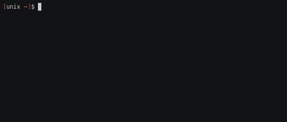
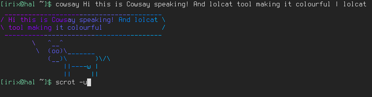
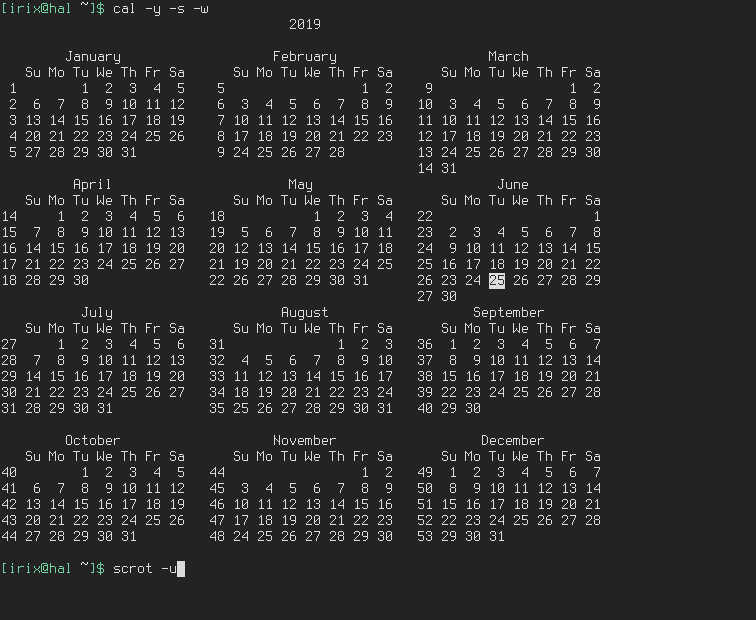

# Awesome CLI programs for Arch Linux

<!-- vim-markdown-toc GFM -->

* [croc](#croc)
* [scrot](#scrot)
* [Betty, the CLI Siri](#betty-the-cli-siri)
* [Check file sizes with `du` `ncdu` and `df`](#check-file-sizes-with-du-ncdu-and-df)
* [Monitor the system with `htop` `gtop` and `powertop`](#monitor-the-system-with-htop-gtop-and-powertop)
* [iponmap](#iponmap)
* [neomutt](#neomutt)
* [mapscii](#mapscii)
* [asciinema and asciicast2gif](#asciinema-and-asciicast2gif)
* [nms](#nms)
* [cmatrix](#cmatrix)
* [lolcat](#lolcat)
* [cowsay](#cowsay)
* [ponysay](#ponysay)
* [irssi](#irssi)
* [testdisk](#testdisk)
* [cal](#cal)
* [bat](#bat)
* [grabc](#grabc)
* [lsix](#lsix)
* [fim image viewer](#fim-image-viewer)
* [qrencode](#qrencode)
* [gallery-dl](#gallery-dl)
* [X220 install map](#x220-install-map)
* [Grok, Codex, and OpenClaw (X220)](#grok-codex-and-openclaw-x220)

<!-- vim-markdown-toc -->

## croc

Install `croc` package and easily send files or folders to another person. Just `croc send file-or-folder` or `croc receive croc-code` 

## scrot

`scrot` is a cli tool for taking SCReenshOTs. It has plenty of options.

## Betty, the CLI Siri

I bet you didn't know this one. Start with `Betty what time is it?`

## Check file sizes with `du` `ncdu` and `df`

## Monitor the system with `htop` `gtop` and `powertop`

## iponmap

Mandatory tool for hackers pretending be cool. It will place a dot in a map when you supply an IP address. Try `iponmap 4.4.4.4`

Needs a real TTY and an IP argument (bare `iponmap` draws an empty map and waits on stdin). Quit with `q` / Escape.

X220 (2026-09-02, verified): binary is `~/.npm-global/bin/iponmap` (`npm i -g iponmap`). Kitty is **not** a login shell, and `~/.bashrc` sources `/etc/profile` which **resets PATH**, so the installer line at the top of bashrc never survives. PATH for npm-global / grok / `~/.local/bin` must be exported **after** that `/etc/profile` line. Also symlink `iponmap` into `/usr/local/bin` so already-open terminals that already have `/usr/local/bin` on PATH can see it without a restart.

## neomutt

The classic mail client `mutt` just supercharged with some extra functionalities.

## mapscii

[Mapscii](https://github.com/rastapasta/mapscii) is one of these amazing cli tools! Just explore highly detailed maps from the command line.

## asciinema and asciicast2gif

[asciinema](https://asciinema.org/) is a tool to record and share terminal sessions. You can install the `asciinema` package in arch, record with `arciinema rec`, stop recording with `Ctrl+D`. You can upload it to asciinema.org or save the `.cast` file locally.

I haven't found an easy way to embed and view the cast file in the markdown files so I use another tool called [asciicast2gif](https://github.com/asciinema/asciicast2gif) that you can install with the AUR package and use it `asciicast2gif -S 1 -s 2 -w 80 -h 5 file.cast file.gif`. Not ideal since the gif files are usually large. See an example below.

## nms

Did you watch [Sneakers](https://en.wikipedia.org/wiki/Sneakers_(1992_film)) the movie? You will probably remember this [scene](https://www.youtube-nocookie.com/embed/GS3npSv8iuM).
`nms` is a command that does exactly that! I usually use it in a pipe. Try `ls | nms` and pretend you are a hacker decoding your own disk.



## cmatrix

For those like me who like to pretend they are hackers you have this tool that will show a matrix encoded screen. Consider it like a terminal screensaver.


## lolcat

`lolcat` is a colourful variant of `cat`. It just displays the file in a full rainbow gradient.

## cowsay

`cowsay` is a funny way to echo messages to the screen. I usually pipe it to `lolcat`



## ponysay

An even cooler alternative to `cowsay` is `ponysay` with it's full colour drawings (do not pipe to `lolcat` or you will mess up the colours!).

## irssi

A great IRC client for the cli. I really miss those IRC days and I use it all the time. For those born in the 80's and later check this [quick start guide](https://irssi.org/documentation/startup/).

## testdisk

`testdisk` is the perfect data recovery tool for the cli. It can undelete files you mistakenly wiped out.

## cal

This simple tool allows you to display a simple calendar with many display options available.



## bat

`bat` is a syntax higlighted `cat`. I use all the time to display files

## grabc

`grabc` is a small color picker utility from the command line. Jus type `grabc` and a small cross cursor will appear. Click on the color you want to capture and it will appear in the terminal as hex value.

## lsix

`lsix` is a simple CLI utility designed to display thumbnail images in Terminal using Sixel graphics. You need to install `imagemagick`. Before start using lsix, make sure your Terminal supports Sixel graphics. If you use UXTerm like me, then add `UXTerm*decTerminalID: vt340` in your `.Xresources` file and apply the changes with `xrdb -merge .Xresources`.

Usage, just type `lsix` or `lsix imagefile`

## fim image viewer

This is a image viewer for the command line with plenty of options. I don't like that it opens in a new window. Trying to sort it out.

## qrencode

A great utility to generate a QR, I use it to share wifi connection settings with smartphones.

`qrencode -o /tmp/wifi.png 'WIFI:S:SSID;T:wpa;P:PASSWORD;;'`

TODO:

- Autoload the image
- Integrate it with the profiles I have in /etc/netctl
- Code a reader and generate a netctl profile

## gallery-dl

A command-line program to download image-galleries and -collections from several image hosting sites <https://github.com/mikf/gallery-dl/blob/master/docs/supportedsites.rst>

## X220 install map

Repo clone: `~/repos/myComputing` (`1c64418`, 2026-09-02). AUR helper: `yay-bin` 13.0.1. npm global prefix: `~/.npm-global`. Verified every binary on PATH.

| Tool | How | Version |
| --- | --- | --- |
| croc | extra/`croc` | 11.3.6 |
| scrot | extra/`scrot` | 2.0.0 |
| betty | AUR/`betty-git` | 0.1.7.r64 |
| ncdu | extra/`ncdu` | 2.9.2 |
| du, df, cal | extra/`util-linux` | 2.42.2 |
| htop | extra/`htop` | 3.5.3 |
| gtop | extra/`gtop` | 1.1.5 |
| powertop | extra/`powertop` | 2.16 |
| iponmap | `npm i -g iponmap` | [nogizhopaboroda/iponmap](https://github.com/nogizhopaboroda/iponmap) |
| neomutt | extra/`neomutt` | 20260616 |
| mapscii | `npm i -g mapscii` | [rastapasta/mapscii](https://github.com/rastapasta/mapscii) |
| asciinema | extra/`asciinema` | 3.2.1 |
| asciicast2gif | `npm i -g asciicast2gif` (+ extra/`gifsicle`) | 0.2.1, deprecated; needs `--allow-scripts=phantomjs-prebuilt` |
| nms | AUR/`no-more-secrets` | 1.0.1 |
| cmatrix | extra/`cmatrix` | 2.0 |
| lolcat | extra/`lolcat` | 100.0.1 |
| cowsay | extra/`cowsay` | 3.8.4 |
| ponysay | extra/`ponysay` | 3.0.3 |
| irssi | extra/`irssi` | 1.4.5 |
| testdisk | extra/`testdisk` | 7.2 |
| bat | extra/`bat` | 0.26.1 |
| grabc | AUR/`grabc` | 1.0.2 |
| lsix | extra/`lsix` (+ extra/`imagemagick`) | 1.9.1 |
| fim | AUR/`fim` | 0.7.1 |
| fbi | extra/`fbida` (companion, not in the list) | 2.14 |
| qrencode | extra/`qrencode` | 4.1.1 |
| gallery-dl | `pipx install gallery-dl` | 1.32.10 |

`corona-cli` was removed from this list (`1c64418`). Do not `sudo npm i -g`; user npm prefix is `~/.npm-global`.

## Grok, Codex, and OpenClaw (X220)

Installed on the Arch X220 (`irix`, 2026-09-02). Verified live:

| Tool | Version | Binary |
| --- | --- | --- |
| Grok Build CLI | 1.0.13 | `~/.grok/bin/grok` |
| Codex CLI | 0.152.0 | `~/.local/bin/codex` |
| OpenClaw | 2026.8.2 | `~/.npm-global/bin/openclaw` |
| Node.js | 26.8.1 | `/usr/bin/node` (pacman) |

Official installers (do not use `sudo npm i -g` for OpenClaw on this host; npm prefix is `~/.npm-global`):

```bash
curl -fsSL https://x.ai/cli/install.sh | bash
curl -fsSL https://chatgpt.com/codex/install.sh | CODEX_NON_INTERACTIVE=1 sh
sudo pacman -S --needed nodejs npm
curl -fsSL https://openclaw.ai/install.sh | bash -s -- --no-prompt --no-onboard
```

Sources: [Grok Build](https://x.ai/news/grok-build-cli), [Codex CLI](https://developers.openai.com/codex/cli), [OpenClaw install](https://docs.openclaw.ai/install).

PATH: Kitty is not a login shell, so `~/.bash_profile` is skipped. `~/.bashrc` sources `/etc/profile`, which resets PATH and drops `~/.npm-global/bin`. Keep the CLI PATH export **after** that `/etc/profile` line (npm-global, grok, `~/.local/bin`). Verified 2026-09-02: without that, `iponmap` is `command not found` in the i3 kitty even though the binary exists.

### OpenClaw default model: 5.3 Spark

Spark is ChatGPT/Codex OAuth-only. Direct OpenAI API-key routes reject it. Source: [OpenClaw model providers](https://docs.openclaw.ai/concepts/model-providers), [OpenAI provider](https://docs.openclaw.ai/providers/openai). Watson host uses the same model id as a fallback (`selfhosted/doc/watson-openclaw-runtime.md`).

X220 default (verified `openclaw config get`):

```json
{
  "primary": "openai/gpt-5.3-codex-spark"
}
```

Runtime: `agents.defaults.models["openai/gpt-5.3-codex-spark"].agentRuntime.id = "codex"`. Gateway is a systemd user unit `openclaw-gateway.service` on loopback `:18789`.

Do **not** pass `--set-default` on OpenAI login, and do not re-run OpenAI onboarding without pinning Spark afterward. Fresh OpenAI/Codex onboarding defaults to `openai/gpt-5.6-sol`.

Sign-in (run on the X220, TTY required; device-code works over SSH with `-t`):

```bash
grok login --device-auth
codex login --device-auth
openclaw models auth login --provider openai --device-code
```

After login, check: `openclaw models status`, `codex login status`. Update OpenClaw with `npm i -g openclaw@latest` then `openclaw gateway restart` (user npm prefix; no sudo).
