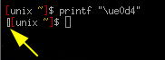

# Arch Linux common daily tasks

<!-- vim-markdown-toc GFM -->

* [Run sudo without a password (absolutely not recommended)](#run-sudo-without-a-password-absolutely-not-recommended)
* [Search](#search)
	* [Search files](#search-files)
	* [Find all files containing specific text](#find-all-files-containing-specific-text)
	* [Search and replace text in files](#search-and-replace-text-in-files)
	* [Search and replace inside vim](#search-and-replace-inside-vim)
* [Time and date](#time-and-date)
	* [Change timezone](#change-timezone)
	* [Sync Time with network](#sync-time-with-network)
* [PDF](#pdf)
	* [Reduce a PDF filesize](#reduce-a-pdf-filesize)
	* [Merge PDF files](#merge-pdf-files)
	* [Convert PDF to PNG image](#convert-pdf-to-png-image)
* [Mount a USB drive](#mount-a-usb-drive)
* [Encryption](#encryption)
	* [GPG Keys](#gpg-keys)
	* [Encryption using asymmetric GPG keys](#encryption-using-asymmetric-gpg-keys)
	* [Transparent edit of gpg encrypted files in vim](#transparent-edit-of-gpg-encrypted-files-in-vim)
	* [Encrypt a file or directory with Symmetric GPG](#encrypt-a-file-or-directory-with-symmetric-gpg)
	* [Steganography. Paranoid level 2](#steganography-paranoid-level-2)
* [Create custom functions](#create-custom-functions)
* [Fonts](#fonts)
	* [Install a font](#install-a-font)
	* [Siji Font in Polybar](#siji-font-in-polybar)
	* [Add new glyghs to Siji](#add-new-glyghs-to-siji)
* [VNC server](#vnc-server)
	* [Starting a VNC server](#starting-a-vnc-server)
* [Screen](#screen)
	* [Show the connected displays](#show-the-connected-displays)
	* [Set physical dimensions of your display](#set-physical-dimensions-of-your-display)
	* [Fix overscan problems in HDMI](#fix-overscan-problems-in-hdmi)
* [Dummy serial and lp ports](#dummy-serial-and-lp-ports)
* [Terminal](#terminal)
	* [Find the width and height of a terminal window](#find-the-width-and-height-of-a-terminal-window)
	* [Open a terminal emulator in Thunar](#open-a-terminal-emulator-in-thunar)
* [Cron jobs](#cron-jobs)
* [Pandoc](#pandoc)
* [Convert docx to md (with images)](#convert-docx-to-md-with-images)

<!-- vim-markdown-toc -->

## Run sudo without a password (absolutely not recommended)

This is more to check if this is happening rather than actually doing it. Edit `/etc/sudoers` with `sudo visudo` and you can add your username

`my_username ALL=(ALL) NOPASSWD:ALL`

or a group like `wheel`

`%wheeel ALL=(ALL) NOPASSWD:ALL`

## Search

### Search files

If the file has been indexed `locate filename` otherwise `find . -name 'filename'

### Find all files containing specific text

`grep -rnw '/path/to/somewhere/' -e 'pattern'`

- `-r` or `-R` is recursive,
	- `-n` is line number
	- `-w` stands for match the whole word.
	- `-l` (lower-case L) can be added to just give the file name of matching files.

Along with these, `--exclude`, `--include`, `--exclude-dir` flags could be used for efficient searching:

This will only search through those files which have .c or .h extensions:

`grep --include=\*.{c,h} -rnw '/path/to/somewhere/' -e "pattern"`

This will exclude searching all the files ending with .o extension:

`grep --exclude=*.o -rnw '/path/to/somewhere/' -e "pattern"`

For directories it's possible to exclude a particular directory(ies) through --exclude-dir parameter. For example, this will exclude the dirs dir1/, dir2/ and all of them matching *.dst/:

`grep --exclude-dir={dir1,dir2,*.dst} -rnw '/path/to/somewhere/' -e "pattern"`

### Search and replace text in files

You can do it without even opening the files

`sed -i -- 's/foo/bar/g' file`

- `foo` is the text you search
- `bar` is the replacement text
- `file` is the file or files in that folder like `README.md` or `*.md` or `*`

You have to escape some characters like `space` and `.` `*` `^` `$` `[` `]`  `\` `/` with the `\` character

### Search and replace inside vim

`:%s/search/replace/g` use escape char)`\` for escaping `/`

## Time and date

### Change timezone

In my laptop the hardware clock (BIOS clock) is considered by the operating system (arch) as UTC. So it is important to set that appropiately first.

`sudo hwclock --show`

I travel quite often and I need to adjust the timezone in my computer. I do it with `timedatectl`

`timedatectl status` check the current time, date and timezone. The following will appear:

```bash
[unix ~]$ timedatectl status
               Local time: Fri 2019-11-08 18:42:28 CET
           Universal time: Fri 2019-11-08 17:42:28 UTC
                 RTC time: Fri 2019-11-08 17:42:28
                Time zone: Europe/Madrid (CET, +0100)
System clock synchronized: no
              NTP service: inactive
          RTC in local TZ: no
```

`timedatectl list-timezones` check the timezones
`timedatectl set-timezone zone/subzone` Set the timezone

### Sync Time with network

There are many ways to do that, this is the one I use. Start/enable `systemd-timesyncd`. Add time servers in the config file `/etc/systemd/timesyncd.conf`

```bash
[Time]
NTP=0.arch.pool.ntp.org 1.arch.pool.ntp.org 2.arch.pool.ntp.org 3.arch.pool.ntp.org
FallbackNTP=0.pool.ntp.org 1.pool.ntp.org 2.pool.ntp.org 3.pool.ntp.org
```

Check the sync status `timedatectl show-timesync --all`


## PDF

### Reduce a PDF filesize

With ghostscript `gs -sDEVICE=pdfwrite -dCompatibilityLevel=1.4 -dPDFSETTINGS=/screen -dNOPAUSE -dQUIET -dBATCH -sOutputFile=output.pdf input.pdf`

You can change the `screen` option (72 dpi) to `ebook` (150 dpi), `prepress` (300 dpi), `printer` (300 dpi) and `default`.

### Merge PDF files

`pdfunite in-1.pdf in-2.pdf in-n.pdf out.pdf`

### Convert PDF to PNG image

`pdftoppm file.pdf newfilename -png`

## Mount a USB drive

Check the device name with `lsblk` and then use `pmount device [ label ]` and `pumount` to mount/unmount it. If label is given, the mount point will be `/media/label`,
otherwise it will be `/media/device`.

## Encryption

### GPG Keys

- Generate a keypair `gpg --full-gen-key`. **Warning:** The passphrase is usually the weakest link in protecting your private key
- List keys in your keyring `gpg --list-keys`. Your keyring is in `~/.gnupg` most likely
- Export your **public** key `gpg --export --armor --output public.key user-id`
- Backup your **private** key `gpg --export-secret-keys --armor --output privkey.asc user-id`. Place the key in a secure inaccessible place.
- Import the backup of your private key `gpg --import privkey.asc`

### Encryption using asymmetric GPG keys

- `gpg --recipient user-id --armor --encrypt doc` in my case `gpg -r hola@beachlab.org -a -e file` it will output an ascii `file.asc`
- To decrypt `gpg -o file -d file.pgp`

### Transparent edit of gpg encrypted files in vim

Install the `jamessan/vim-gnupg` plugin. Adjust the default recipient in `.vimrc` options. Here's mine

```
" GPG options
let g:GPGPreferArmor=0
" set the default option
let g:GPGDefaultRecipients=["me@beachlab.org"]
``` 

If the file extension is not `md` add at the bottom of the file `/* vim: set filetype=markdown : */`

### Encrypt a file or directory with Symmetric GPG

Symmetric encryption does not require the generation of a key pair and can be used to simply encrypt data with a passphrase.

- To **encrypt a file*** `gpg -c filename` outputs `filename.gpg`. To **decrypt a file** `gpg filename.gpg`.
- To **encrypt directories** `gpgtar -c -o file.gpg dirname`. To **decrypt a directory** `gpgtar -d file.gpg`

You will then be prompted for a passphrase.

### Steganography. Paranoid level 2

When you need to hide a secret you can encrypt the file. But an adversary will know that something is hidden, and they can attempt to break the code by putting some brute force. But if you embed this encrypted secret into an apparently normal file. The third person would not even be aware of the fact that a seemingly harmless looking image or audio file carries a secret message or a file embedded in it. This type of encryption where you hide one file securely into another is called **Steganography**. And I use it a lot.

Install `steghide` command line utility. To embed a secret into an image run:

`steghide embed -ef secret.ggp -cf image.jpg`

You will need another passphrase to embed the secret into the image. To extract the secret from the image

`steghide extract -sf image.jpg`

## Create custom functions

I keep my custom commands in a file called `.custom_functions.sh`. This file is sourced by `.bashrc` where I added this line at the bottom `source .custom_functions.sh`. Inside the file `.custom_functions.sh` I create my custom functions:

```
my_function () {
place your code here
}
```

## Fonts

### Install a font

Move it to `~/.local/share/fonts`. More info [here](https://wiki.archlinux.org/index.php/Fonts)

### Siji Font in Polybar

For displaying siji fonts in Polybar `xfd -fa 'Wuncon Siji'`


Note the glyph code and display display it in a terminal replacing 0x00 `printf "\ue0d4"`



Copy that character and paste in want it in polybar config file


And it will show properly in polybar


### Add new glyghs to Siji

[Clone](https://github.com/TheBeachLab/siji) the repo with the font. Install `gbdfed`, add/edit a glyph, save it and run `install.sh`

> Note: Sometimes after rebooting siji fonts are not displayed in polybar until I reinstall the font again and reload polybar. #TOFIX

## VNC server

I use [TigerVNC](https://tigervnc.org/) for it's easy use.

### Starting a VNC server

Place a password/passphrase in `~/.vnc/passwd`

To start `x0vncserver -display :0 -passwordfile .vnc/passwd`

To stop just close the terminal process.

## Screen

### Show the connected displays

`xrandr`

### Set physical dimensions of your display

Useful for showing real dimensions at 100% `xrandr --fbmm 310x175`

### Fix overscan problems in HDMI

This should work `xrandr --output HDMI1 --set underscan on --set "underscan vborder" 25 --set "underscan hborder" 40` but it is not working in my case

## Dummy serial and lp ports

In order to create a dummy serial port for developing purposes install `tty0tty-git` AUR package and load the module:

```bash
sudo depmod
sudo modprobe tty0tty
```

You will see a number of serial ports `/dev/tntx`, make sure you give them permissions

```bash
sudo chmod 666 /dev/tnt*
```

For testing printers and other devices, just send to `/dev/null`

## Terminal

### Find the width and height of a terminal window

- `tput cols` tells you the number of columns.
- `tput lines` tells you the number of rows.

### Open a terminal emulator in Thunar

Edit `~/.config/xfce4/helpers.rc` and add/edit `TerminalEmulator=urxvt` and then add a custom action in Thunar:

`exo-open --working-directory %f --launch TerminalEmulator`

## Cron jobs

Install `cronie` package and `systemctl start cronie && systemctl enable cronie`. List cron jobs with `crontab -l`. Add jobs with `crontab -e`. This is my crontab with a snippet as a cheat sheet:

```bash
#* * * * * command to be executed
#- - - - -
#| | | | |
#| | | | +----- day of week (0 - 6) (Sunday=0)
#| | | +------- month (1 - 12)
#| | +--------- day of month (1 - 31)
#| +----------- hour (0 - 23)
#+------------- min (0 - 59)

# Clear cache every Monday at 10pm
0 22 * * 1 yay -Scc --noconfirm
```

You can also use keywords instead `@yearly @monthly @weekly @daily @hourly @reboot`. Cron jobs are great to do some background tasks *while your computer is on*.

There are some other jobs you want to execute at specific intervals, and when you miss a scheduled task, as soon as the computer is up. Cronie includes `anacron` which processes jobs asynchronously, even if the computer was down at the time of the job. My `/etc/anacrontab`

```bash
# /etc/anacrontab: configuration file for anacron

# See anacron(8) and anacrontab(5) for details.

SHELL=/bin/sh
PATH=/sbin:/bin:/usr/sbin:/usr/bin
MAILTO=root
# the maximal random delay added to the base delay of the jobs
RANDOM_DELAY=45
# the jobs will be started during the following hours only
START_HOURS_RANGE=3-22

#period in days   delay in minutes   job-identifier   command
1	5	cron.daily		nice run-parts /etc/cron.daily
7	25	cron.weekly		nice run-parts /etc/cron.weekly
@monthly 45	cron.monthly		nice run-parts /etc/cron.monthly

# Clear cache every Monday at 10pm
7 15 clear-cache-weekly yay -Scc --noconfirm
```

You can check the validity of your anacrontab file with `anacron -T`

## Pandoc

## Convert docx to md (with images)

`pandoc --extract-media=. -s file.docx --wrap=none --reference-links -t markdown_strict -o file.md`

for a batch of files

`for i in *.docx ; do echo '$i' && pandoc --extract-media=. -s $i --wrap=none --reference-links -t markdown_strict -o $(basename $i .docx).md ; done`
