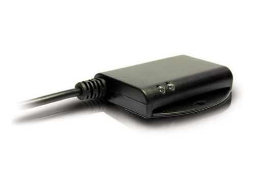
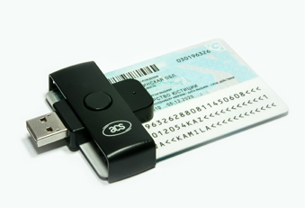
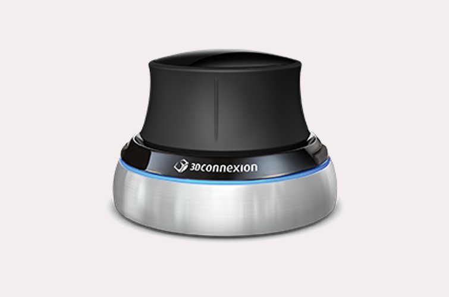
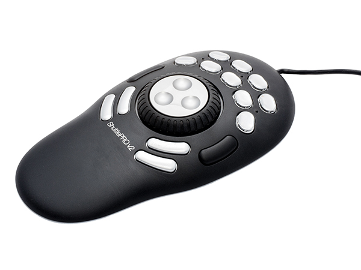
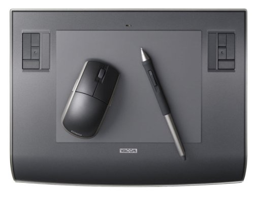
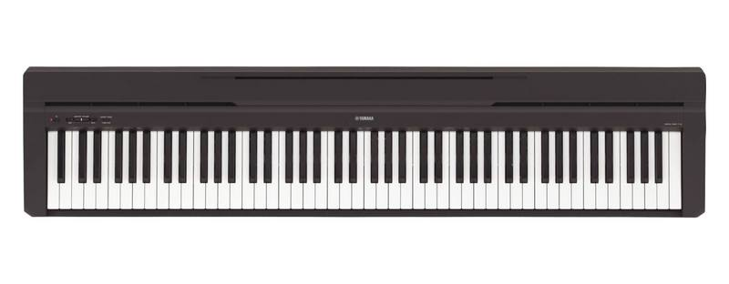
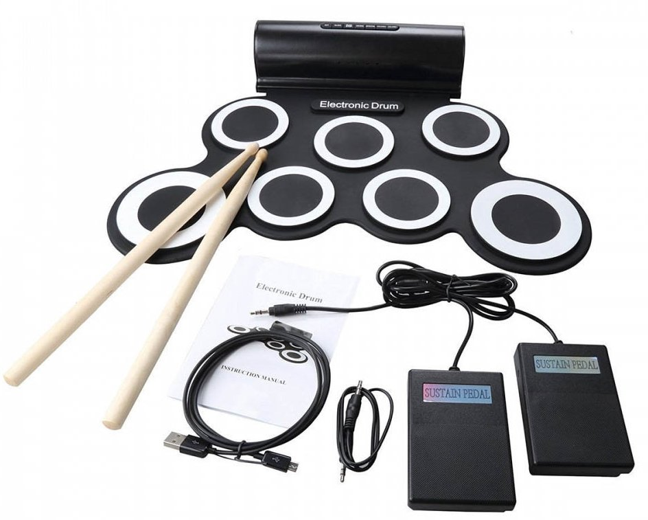
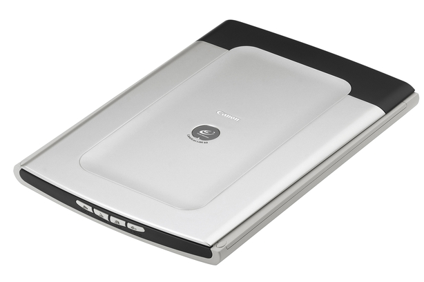

# Hardware in Arch Linux

<!-- vim-markdown-toc GFM -->

* [PS3 Eye](#ps3-eye)
* [DNIe reader](#dnie-reader)
* [Asus MB168B+ USB display](#asus-mb168b-usb-display)
* [HDMI](#hdmi)
* [Space Navigator](#space-navigator)
* [Contour Shuttle Pro 2](#contour-shuttle-pro-2)
* [Wacom Intuos 3](#wacom-intuos-3)
* [Yamaha P-45](#yamaha-p-45)
* [Electronic drum](#electronic-drum)
* [Canon LiDE 60](#canon-lide-60)
* [eGPU Nvidia RTX2070 Super in a Razer X Thunderbolt external enclosure](#egpu-nvidia-rtx2070-super-in-a-razer-x-thunderbolt-external-enclosure)
* [eGPU Beast 8.5c](#egpu-beast-85c)
	* [For Radeon HD 6450](#for-radeon-hd-6450)
* [Trackpad tips](#trackpad-tips)
* [Keeyees Logic Analizer (Saleale Logic 8 clone)](#keeyees-logic-analizer-saleale-logic-8-clone)
* [Remapping a secondary keyboard](#remapping-a-secondary-keyboard)

<!-- vim-markdown-toc -->

## PS3 Eye

Placeholder for Playstation 3 Eye

## DNIe reader

I have an LTC31



And an ACR38 from Estonia digital citizenship



Insert your DNIe reader and check with `lsusb`, you should see one of your readers, among other USB devices

```bash
[unix ~]$ lsusb
Bus 001 Device 013: ID 0783:0006 C3PO LTC31v2
Bus 001 Device 015: ID 072f:90cc Advanced Card Systems, Ltd ACR38 SmartCard Reader
...
```

Install the following packages `opensc ccid` other sources say ` pcsc-perl pcsc-tools pcsclite ` and AUR `libpkcs11-dnie ca-certificates-dnie`. Then try to read the scanner with `pcsc_scan`

```bash
[unix ~]$ pcsc_scan
Using reader plug'n play mechanism
Scanning present readers...
0: C3PO LTC31 v2 (00426712) 00 00

Wed Dec  4 11:14:10 2019
 Reader 0: C3PO LTC31 v2 (00426712) 00 00
  Event number: 1
  Card state: Card removed,
 /
```

> If you see something like `SCardEstablishContext: Service not available` try restarting the service with `systemctl restart pcscd.socket` and try again.

With a DNIe inserted you should see this:

```bash
[unix ~]$ pcsc_scan
Using reader plug'n play mechanism
Scanning present readers...
0: C3PO LTC31 v2 (00426712) 00 00

Wed Dec  4 11:16:59 2019
 Reader 0: C3PO LTC31 v2 (00426712) 00 00
  Event number: 2
  Card state: Card inserted,
  ATR: 3B 7F 96 00 00 00 6A 44 4E 49 65 10 01 01 55 04 21 03 90 00

ATR: 3B 7F 96 00 00 00 6A 44 4E 49 65 10 01 01 55 04 21 03 90 00
+ TS = 3B --> Direct Convention
+ T0 = 7F, Y(1): 0111, K: 15 (historical bytes)
  TA(1) = 96 --> Fi=512, Di=32, 16 cycles/ETU
    250000 bits/s at 4 MHz, fMax for Fi = 5 MHz => 312500 bits/s
  TB(1) = 00 --> VPP is not electrically connected
  TC(1) = 00 --> Extra guard time: 0
+ Historical bytes: 00 6A 44 4E 49 65 10 01 01 55 04 21 03 90 00
  Category indicator byte: 00 (compact TLV data object)
    Tag: 6, len: A (pre-issuing data)
      Data: 44 4E 49 65 10 01 01 55 04 21
    Mandatory status indicator (3 last bytes)
      LCS (life card cycle): 03 (Initialisation state)
      SW: 9000 (Normal processing.)

Possibly identified card (using /usr/share/pcsc/smartcard_list.txt):
3B 7F 96 00 00 00 6A 44 4E 49 65 10 01 01 55 04 21 03 90 00
3B 7F 96 00 00 00 6A 44 4E 49 65 10 01 01 55 04 .. 03 90 00
        DNIE Spain (eID)
        http://www.dnielectronico.es/PortalDNIe/
 |
```

Now in Firefox go to preferences, search for `devices` and click on `security devices`. Click `load` and add a meaningful name like `DNIe` and locate the following file `/usr/lib/libpkcs11-dnietif.so`. Now you should see the reader, if you select the reader and click on `log in` you can enter your DNIe pin/password and you are all set.

> Missing adding ACR38 device in Firefox

To electronically sign documents like PDF install the AUR package `autofirma`.

## Asus MB168B+ USB display


This is a displaylink USB screen I use for video editing and also following tutorials while I run a program. Make sure you have `linux-headers` package already installed. You must install the [displaylink](https://aur.archlinux.org/packages/displaylink/) AUR package that allows configuring displaylink monitors using [Xrandr](https://wiki.archlinux.org/index.php/Xrandr). Then create the file `/usr/share/X11/xorg.conf.d/20-evdidevice.conf` with the following content:

```bash
Section "OutputClass"
	Identifier "DisplayLink"
	MatchDriver "evdi"
	Driver "modesetting"
	Option  "AccelMethod" "none"
EndSection
```

and reboot. There is a flickering in the cursor sometimes. I still haven't debug the origin.

My config for `xrandr` screen on the right side:

`xrandr --output eDP-1 --primary --auto --output DVI-I-1-1 --right-of eDP-1 --auto`

If I want it rotated then

`xrandr --output eDP-1 --primary --auto --output DVI-I-1-1 --rotate left --left-of eDP-1 --auto`

It is preferable to place the rotated screen on the left side due to the view angle specs of the screen. The view angle from above is much greater than from below. So if you place it on the right side, you are viewing the screen from below. Whilst if you place it on the left side you are viewing it from above.

mirror screen:

`xrandr --output eDP-1 --primary --auto --output DVI-I-1-1 --same-as eDP-1 --auto`

## HDMI

 My config for extra screen:

`xrandr --output eDP-1 --primary --auto --output HDMI-1 --right-of eDP-1 --auto`

or mirror:

`xrandr --output eDP-1 --primary --auto --output HDMI-1 --same-as eDP-1 --auto`

## Space Navigator



For a [free, open source alternative driver](http://spacenav.sourceforge.net/) to the proprietary [3DConnexion](https://www.3dconnexion.com), install the packages `spacenavd` and the config tool `spnavcfg`. Start the mouse with:

`sudo systemctl start spacenavd`

Enable the service if you want to run it everytime you boot.

`sudo systemctl enable spacenavd`

At the time of writing (September 2019) Space Navigator is having trouble with the Appimage version of FreeCAD. It works just fine in the AUR compiled version. It just takes a long time to compile.

## Contour Shuttle Pro 2



This is a device I use to edit video. I Installed `contour-shuttle-git` AUR package and now I am missing the key configuration file for Lightworks

https://www.lwks.com/index.php?option=com_kunena&func=view&catid=217&id=83353&Itemid=

https://www.lwks.com/index.php?option=com_kunena&func=view&catid=217&id=116188&Itemid=81

http://freshmeat.sourceforge.net/projects/shuttlepro

## Wacom Intuos 3



My old tablet for drawing and painting, still works like a charm. I am learning to use it now with grease pencil, the new feature in blender 2.8. You need to install the  `xf86-input-wacom` and reboot. You should now see some devices with the command `xsetwacom list devices`.

```bash
[unix ~]$ xsetwacom list devices
Wacom Intuos3 6x8 Pen stylus            id: 10  type: STYLUS
Wacom Intuos3 6x8 Pad pad               id: 11  type: PAD
Wacom Intuos3 6x8 Pen eraser            id: 17  type: ERASER
Wacom Intuos3 6x8 Pen cursor            id: 18  type: CURSOR
```

If you use dual head monitors `xrandr` sets both monitors as one big screen, mapping the tablet to the whole virtual screen and deforming aspect ratio. For a solution, map the Stylus and the eraser (id 10 and 17) to the desired screen, in my case, eDP-1.

```bash
xsetwacom set 10 MapToOutput eDP-1
xsetwacom set 17 MapToOutput eDP-1
```

Graphical config tool `kcm-wacomtablet`.

## Yamaha P-45



This electronic piano can be used as a MIDI input in LMMS and other software. I like it because it has pressure sensitive keys and it's full size. It does not need any driver. Just connect it via usb and check that it is properly detected:

```bash
[unix ~]$ lsusb
Bus 001 Device 009: ID 0499:160f Yamaha Corp. P-105
```

Then with `alsa-utils` installed check the device number for input and output:

```bash
[unix ~]$ aconnect -i
client 0: 'System' [type=kernel]
    0 'Timer           '
    1 'Announce        '
client 14: 'Midi Through' [type=kernel]
    0 'Midi Through Port-0'
client 20: 'Digital Piano' [type=kernel,card=1]
    0 'Digital Piano MIDI 1'

[unix ~]$ aconnect -o
client 14: 'Midi Through' [type=kernel]
    0 'Midi Through Port-0'
client 20: 'Digital Piano' [type=kernel,card=1]
    0 'Digital Piano MIDI 1'
```

And you can connect this device to your DAW or MIDI software. Check the activity with `aseqdump`. So far is not detecting pressure sensitivity. I haven't checked the foot pedal yet.

```bash
[unix ~]$ aseqdump -p 20
Waiting for data. Press Ctrl+C to end.
Source  Event                  Ch  Data
 20:0   Clock
 20:0   Active Sensing
 20:0   Clock
 20:0   Clock
 20:0   Note off                0, note 91
 20:0   Clock
 20:0   Clock
 20:0   Note on                 0, note 93, velocity 64
 20:0   Clock
 20:0   Clock
 20:0   Clock
 20:0   Note off                0, note 93
 20:0   Clock
 20:0   Note on                 0, note 91, velocity 64
 20:0   Clock
 20:0   Clock
 20:0   Active Sensing
 20:0   Clock
 20:0   Clock
 20:0   Note off                0, note 91
 20:0   Clock
 20:0   Note on                 0, note 93, velocity 64
 20:0   Clock
 20:0   Clock
 20:0   Clock
 20:0   Clock
 20:0   Note off                0, note 93
 20:0   Note on                 0, note 91, velocity 64
 20:0   Clock
 20:0   Clock
 20:0   Clock
 20:0   Active Sensing
 20:0   Note off                0, note 91
```

## Electronic drum



I bought this electronic drum for my kid in fab12 Shenzhen and today while I was about to pack it for the basement I saw USB MIDI among the chinese characters. So I decided to give it a try and see if if was a USB MIDI device. When I plug it `dmesg -w` says

```bash
[ 2576.677890] usb 1-1: new full-speed USB device number 20 using xhci_hcd
[ 2576.820549] usb 1-1: New USB device found, idVendor=0c45, idProduct=7114, bcdDevice= 1.01
[ 2576.820557] usb 1-1: New USB device strings: Mfr=1, Product=2, SerialNumber=0
[ 2576.820561] usb 1-1: Product: USB DEVICE
[ 2576.820565] usb 1-1: Manufacturer: SONiX
[ 2576.825350] hid-generic 0003:0C45:7114.0003: hiddev0,hidraw1: USB HID v1.11 Device [SONiX USB DEVICE] on usb-0000:00:14.0-1/input0
```

and `aconnect -i`

```bash
[unix ~]$ aconnect -i
client 0: 'System' [type=kernel]
    0 'Timer           '
    1 'Announce        '
client 14: 'Midi Through' [type=kernel]
    0 'Midi Through Port-0'
client 28: 'USB DEVICE' [type=kernel,card=3]
    0 'USB DEVICE MIDI 1'
```

So it't a MIDI device!!! Let's listen `aseqdump -p 28`

```bash
Waiting for data. Press Ctrl+C to end.
Source  Event                  Ch  Data
 28:0   Note on                 9, note 43, velocity 127
 28:0   Note off                9, note 43, velocity 127
 28:0   Note on                 9, note 44, velocity 127
 28:0   Note off                9, note 44, velocity 127
 28:0   Note on                 9, note 36, velocity 127
 28:0   Note off                9, note 36, velocity 127
```

It has notes 49, 48 and 51 in the top row, 38, 46, 45, 43 in the bottom row, and 36, 44 in the pedals. With this and the p45 keyboard I should be able to produce some music.

## Canon LiDE 60



Install `sane` and optional the frontend `xsane`. Add yourself to the scanner group and reboot `sudo usermod -a -G scanner $USER`

Check that your scanner is listed `scanimage -L`. If you don't want your cameras to be listed comment `v4l` in `/etc/sane.d/dll.conf`.

Try to scan something through xsane or manually using the device name shown in the step above:

`scanimage --device "genesys:libusb:001:004" --format=png > test.png`

## eGPU Nvidia RTX2070 Super in a Razer X Thunderbolt external enclosure

First make sure that your BIOS has a security setting that allows you to use the Thunderbolt port as a display port. Install the `nvidia nvidia-settings nvidia-utils opencl-nvidia cuda cudnn nvtop` packages. You can use the card as a coprocessor for training neural networks, blender cycles, etc. But if you want to use Blender EEVEE, X-Plane, etc you need to connect an external monitor to the card and switch GPUs.

How to switch GPUs for internal to eGPU:

- Clone the following repository <https://github.com/TheBeachLab/gswitch>
- Follow the installation instructions
- To switch to eGPU `sudo gswitch egpu`
- To switch to internal `sudo gswitch internal`

> Note: From time to time the PCI ID of the egpu will change and switching to the egpu will stop working. In that case run `sudo gswitch setup` again.

## eGPU Beast 8.5c

This is an external GPU adapter that I bought on [Amazon](https://amzn.to/2nruDnH). My version has a expresscard that I use for my Thinkpad X220. Seems to work with the Radeon HD6450. The following command detects the card:

`lspci -k | grep -A 2 -i "VGA"`

But does not detect my Nvidia 8800GT so far. Still researching.

### For Radeon HD 6450

Install the open source driver `xf86-video-ati`. Install also `radeon-profile-git` AUR package which installs a qt application `radeon-profile` to display info about a Radeon card.

If I insert the expresscard after booting, `radeon-profile` shows no card. I suspect the Kernel module is not loaded.

If I reboot with the expresscard inserted then the radeon kernel module loads and the screen goes to the radeon HDMI, leaving the laptop screen black. `startx` fails: XF86enableIOPorts operation not permitted. KMS Kernel modesetting enabled

## Trackpad tips

I use `libinput` driver instead of the former `xf86-input-synaptic`. Something that I hate of the standars behaviour of the trackpad is the area for middle and right click, because I usually accidentally click the wrong button.

There is another problem. By default touchpad is disabled while typing. But for playing with the synths knobs you will want it activated. In order to have the touchpad working while a key is pressed do the following:

```bash
[unix ~]$ xinput
⎡ Virtual core pointer                          id=2    [master pointer  (3)]
⎜   ↳ Virtual core XTEST pointer                id=4    [slave  pointer  (2)]
⎜   ↳ Synaptics TM3289-002                      id=14   [slave  pointer  (2)]
⎜   ↳ TPPS/2 ALPS TrackPoint                    id=15   [slave  pointer  (2)]
⎣ Virtual core keyboard                         id=3    [master keyboard (2)]
    ↳ Virtual core XTEST keyboard               id=5    [slave  keyboard (3)]
    ↳ Power Button                              id=6    [slave  keyboard (3)]
    ↳ Video Bus                                 id=7    [slave  keyboard (3)]
    ↳ Sleep Button                              id=8    [slave  keyboard (3)]
    ↳ Integrated Camera: Integrated C           id=11   [slave  keyboard (3)]
    ↳ AT Translated Set 2 keyboard              id=12   [slave  keyboard (3)]
    ↳ ThinkPad Extra Buttons                    id=13   [slave  keyboard (3)]
```

In my case it is the touchpad id is 14. But this number is not persistent across sessions, so it is better to use the name. Now list the properties:

```bash
[unix ~]$ xinput list-props 'Synaptics TM3289-002'
Device 'Synaptics TM3289-002':
        Device Enabled (169):   1
        Coordinate Transformation Matrix (171): 1.000000, 0.000000, 0.000000, 0.000000, 1.000000, 0.000000, 0.000000, 0.000000, 1.000000
        libinput Tapping Enabled (322): 0
        libinput Tapping Enabled Default (323): 0
        libinput Tapping Drag Enabled (324):    1
        libinput Tapping Drag Enabled Default (325):    1
        libinput Tapping Drag Lock Enabled (326):       0
        libinput Tapping Drag Lock Enabled Default (327):       0
        libinput Tapping Button Mapping Enabled (328):  1, 0
        libinput Tapping Button Mapping Default (329):  1, 0
        libinput Natural Scrolling Enabled (304):       0
        libinput Natural Scrolling Enabled Default (305):       0
        libinput Disable While Typing Enabled (330):    1
        libinput Disable While Typing Enabled Default (331):    1
        libinput Scroll Methods Available (306):        1, 1, 0
        libinput Scroll Method Enabled (307):   1, 0, 0
        libinput Scroll Method Enabled Default (308):   1, 0, 0
        libinput Click Methods Available (332): 1, 1
        libinput Click Method Enabled (333):    0, 1
        libinput Click Method Enabled Default (334):    1, 0
        libinput Middle Emulation Enabled (311):        0
        libinput Middle Emulation Enabled Default (312):        0
        libinput Accel Speed (313):     0.000000
        libinput Accel Speed Default (314):     0.000000
        libinput Left Handed Enabled (318):     0
        libinput Left Handed Enabled Default (319):     0
        libinput Send Events Modes Available (289):     1, 1
        libinput Send Events Mode Enabled (290):        0, 0
        libinput Send Events Mode Enabled Default (291):        0, 0
        Device Node (292):      "/dev/input/event14"
        Device Product ID (293):        1739, 0
        libinput Drag Lock Buttons (320):       <no items>
        libinput Horizontal Scroll Enabled (321):       1
```

And I see the property that causes the problem is *libinput Disable While Typing Enabled* so we set it to zero

`xinput set-prop 'Synaptics TM3289-002' 'libinput Disable While Typing Enabled' 0` voila!

To make these changes persistent at every login, write your desired settings in `/etc/X11/xorg.conf.d/30-touchpad.conf`. These are mine, where I have disabled tapping (my hand are shaky with so much coffee) and I have also disabled the 3 regions with the CLickMethod option. Check libinput documentation for the available options.

```bash
Section "InputClass"
	Identifier "touchpad"
	Driver "libinput"
	MatchIsTouchpad "on"
	Option "Tapping" "off"
	Option "ClickMethod" "clickfinger"
    Option "DisableWhileTyping" "false"
EndSection
```

## Keeyees Logic Analizer (Saleale Logic 8 clone)

During Fab Academy Instructors' Bootcamp I learned about this logic analyzer. Henk was using it in his Linux computer so I got one from Amazon. Is the Keeyees 8Ch 24Mhz. I downloaded Saleale Logic 1.2.18, set the permissions according to the instructions in Drivers folder and it just works perfectly.

## Remapping a secondary keyboard

Connect the keyboard and find the device ID `xinput list`. I am connecting an Apple keyboard:

```bash
⎣ Virtual core keyboard                         id=3    [master keyboard (2)]
    ↳ Virtual core XTEST keyboard               id=5    [slave  keyboard (3)]
    ↳ Power Button                              id=6    [slave  keyboard (3)]
    ↳ Video Bus                                 id=7    [slave  keyboard (3)]
    ↳ Sleep Button                              id=8    [slave  keyboard (3)]
    ↳ Integrated Camera: Integrated C           id=13   [slave  keyboard (3)]
    ↳ AT Translated Set 2 keyboard              id=15   [slave  keyboard (3)]
    ↳ ThinkPad Extra Buttons                    id=16   [slave  keyboard (3)]
    ↳ Apple, Inc Apple Keyboard                 id=9    [slave  keyboard (3)]
    ↳ Apple, Inc Apple Keyboard                 id=10   [slave  keyboard (3)]
```

Now find out one key you want to remap `xev | awk -F'[ )]+' '/^KeyPress/ { a[NR+2] } NR in a { printf "%-3s %s\n", $5, $8 }'`

For example pressing `p` in the external keyboard shows `33 p`
