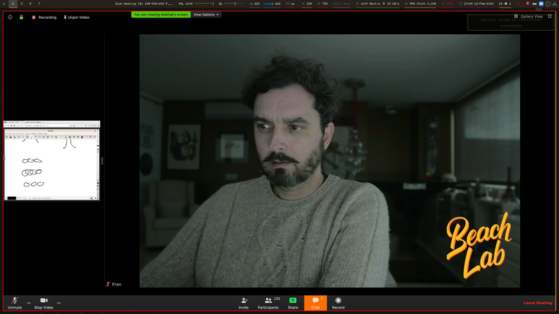

# Video in Arch linux

<!-- vim-markdown-toc GFM -->

* [Download youtube video](#download-youtube-video)
* [Download youtube video and subtitles](#download-youtube-video-and-subtitles)
* [Download youtube audio](#download-youtube-audio)
* [Hardcode subtitles into video](#hardcode-subtitles-into-video)
* [Download a specific format from youtube video](#download-a-specific-format-from-youtube-video)
* [Convert GIF to MP4](#convert-gif-to-mp4)
* [Unsorted ffmpeg-fu](#unsorted-ffmpeg-fu)
* [DSLR Video Webcam](#dslr-video-webcam)
	* [Hardware required](#hardware-required)
	* [Software required](#software-required)
	* [Canon 7D](#canon-7d)
	* [Canon M6](#canon-m6)
* [Virtual webcam from OBS output](#virtual-webcam-from-obs-output)
	* [v4l2loopback](#v4l2loopback)
	* [OBS Studio Plugin](#obs-studio-plugin)

<!-- vim-markdown-toc -->

## Download youtube video 

`youtube-dl` URL-VIDEO

>  Slow downloads? Try  `youtube-dl --format best` URL-VIDEO

## Download youtube video and subtitles

`youtube-dl --write-auto-sub` URL-VIDEO

## Download youtube audio

`youtube-dl -x --audio-format mp3` URL-VIDEO 

## Hardcode subtitles into video

`ffmpeg -i` VIDEO-FILE `-vf subtitles=`SUBS-FILE OUTPUT-FILE

## Download a specific format from youtube video

First check the available formats

`youtube-dl -F GKgfCthuiV0` where GKgfCthuiV0 is the youtube code of the video

```bash
[youtube] GKgfCthuiV0: Downloading webpage
[youtube] GKgfCthuiV0: Downloading video info webpage
[info] Available formats for GKgfCthuiV0:
format code  extension  resolution note
249          webm       audio only tiny   69k , opus @ 50k (48000Hz), 3.38MiB
250          webm       audio only tiny   87k , opus @ 70k (48000Hz), 4.29MiB
140          m4a        audio only tiny  130k , m4a_dash container, mp4a.40.2@128k (44100Hz), 6.95MiB
251          webm       audio only tiny  157k , opus @160k (48000Hz), 7.91MiB
160          mp4        192x144    144p   13k , avc1.4d400b, 25fps, video only, 436.59KiB
133          mp4        320x240    240p   18k , avc1.4d400d, 25fps, video only, 528.49KiB
278          webm       192x144    144p   27k , webm container, vp9, 25fps, video only, 755.36KiB
394          mp4        192x144    144p   30k , av01.0.00M.08, 25fps, video only, 892.15KiB
395          mp4        320x240    240p   47k , av01.0.00M.08, 25fps, video only, 1.17MiB
242          webm       320x240    240p   48k , vp9, 25fps, video only, 1.13MiB
18           mp4        400x300    240p  147k , avc1.42001E, mp4a.40.2@ 96k (44100Hz), 7.90MiB (best)
```

Select the one you want, in my case 251, which is the highest audio quality

`youtube-dl -f 251 GKgfCthuiV0`

Optional: transcode the webm file into wav (or any other) format you want

`ffmpeg -i file.webm file.wav`

## Convert GIF to MP4

`ffmpeg -i animated.gif -movflags faststart -pix_fmt yuv420p -vf "scale=trunc(iw/2)*2:trunc(ih/2)*2" video.mp4`

Explanation

- `movflags` – This option optimizes the structure of the MP4 file so the browser can load it as quickly as possible.
- `pix_fmt` – MP4 videos store pixels in different formats. We include this option to specify a specific format which has maximum compatibility across all browsers.
- `vf` – MP4 videos using H.264 need to have a dimensions that are divisible by 2. This option ensures that’s the case.

## Unsorted ffmpeg-fu

- Neil's variable bit rate 1080p MP3: `ffmpeg -i input_video -vcodec libx264 -crf 25 -preset medium -vf scale=-2:1080 -acodec libmp3lame -q:a 4 -ar 48000 -ac 2 output_video.mp4`
- Neil's no audio: `ffmpeg -i input_video -vcodec libx264 -b:v 1000k -vf scale=-2:1080 -an output_video.mp4`
- Use nvidia hw encoder `-vcodec h264_nvenc`

## DSLR Video Webcam

### Hardware required

You need a capture card to get the HDMI out signal from the DSLR. I bought a cheap HDMI to USB3 capture card in Amazon that works with the V4L2 module without drivers, just plug and play. The card is unbranded and the chipset inside is:

```bash
[66367.259465] usb 2-2: Product: FHD Capture
[66367.259468] usb 2-2: Manufacturer: VXIS Inc
[66367.269584] uvcvideo: Found UVC 1.00 device FHD Capture (1bcf:2c99)
```

The DSLR camera will become now a Webcam. You can even select it in your videoconferences.

It is convenient that you also get a AC battery adapter to make sure the battery won't die during capture.

### Software required

You can capture video with pretty much anything but I mostly use [OBS Studio](https://obsproject.com/). It allows you to create scenes, overlays, green screen, etc.

### Canon 7D

The Canon 7D has a mini HDMI port out. With the Canon firmware 2.0.3 I cannot obtain a clean HDMI out. There is always the focus rectangle there. So I downloaded [Magoc Lantern Firmware](https://magiclantern.fm/). To control the camera settings I use [Entangle](https://entangle-photo.org/) which allows me to capture images as well as control the camera settings.

### Canon M6

Canon M6 has a micro HDMI port. With the Canon M6 I can obtain a clean HDMI out in manual focus. But controlling the camera settings is just annoying. USB tether does not seem to work and there is a Canon App which is so faulty. 

Magic Lantern is not available for the M6. It could run [CHDK](https://chdk.fandom.com/wiki/CHDK) but at the moment of writing the firmware is still unported.

## Virtual webcam from OBS output



There is a way. Tricky, not trivial, to pipe the output of OBS studio into a virtual webcam that you can use in a videoconference (for instance). Here's how I do it.

### v4l2loopback

First clone and install `v4l2loopback` from here [https://github.com/umlaeute/v4l2loopback](https://github.com/umlaeute/v4l2loopback). You can load the kernel module like this:

`sudo modprobe v4l2loopback video_nr=9`

This will create a virtual video device `/dev/video9`

When you want to remove the device use `sudo rmprobe v4l2loopback`

### OBS Studio Plugin

I installed the AUR package `obs-v4l2sink` which is actually a sink where OBS will pour the virtual webcam. Then in OBS top menu select `tools/v4l2sink` and choose the video device `/dev/video9` that you activated before and `YUV12` format.

You will be able now to use a new webcam that will appear (working in zoom and Firefox). Not yet working for Chrome.

